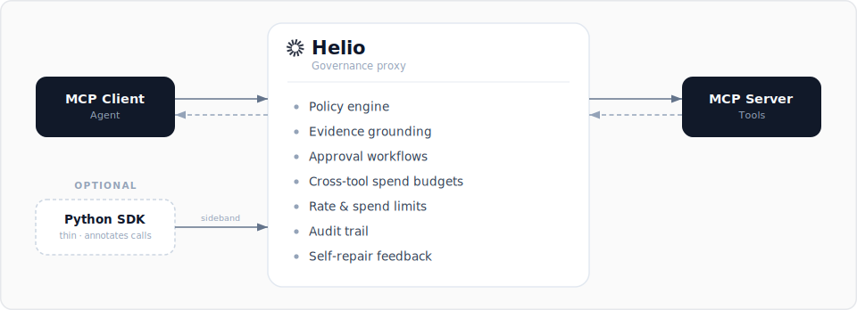

<p align="center">
  <h1 align="center">Helio</h1>
  <p align="center">Open-source governance proxy for AI agents</p>
</p>

<p align="center">
  <a href="https://github.com/gethelio/helio/actions/workflows/ci.yml"></a>
  <a href="https://github.com/gethelio/helio/blob/main/LICENSE"></a>
  <a href="https://www.npmjs.com/package/@gethelio/proxy"></a>
</p>

<p align="center">
  <a href="./docs/getting-started.md">Getting Started</a> · <a href="./docs/configuration.md">Docs</a> · <a href="./CONTRIBUTING.md">Contributing</a>
</p>

---

Helio is an MCP proxy that sits between your AI agents and the tools they use. Every tool call passes through Helio, which enforces policies, checks evidence, routes approvals, tracks spend, and records everything - **without changing your agent code or your MCP servers.**

```bash
npx @gethelio/proxy init
```

`@gethelio/proxy` is the only Node package you install. It ships the proxy runtime and bundled dashboard UI assets together.

## Why Helio?

Your agent just called an API you didn't expect. It spent money you didn't authorize. It modified a production record you can't easily undo.

Model providers are building governance for their own platforms but your agents run across Claude, ChatGPT, LangChain, CrewAI, and custom frameworks. No single platform governs the full picture. And none of them govern what happens in downstream systems like Stripe, Salesforce, or GitHub.

Helio governs what agents **do to the rest of the world** across any MCP-compatible agent, any tool, any platform.

## How It Works

<p align="center">
  
</p>

Two integration paths:

1. **Proxy only**: Point your MCP client at Helio instead of your MCP server. Zero code changes. Immediate governance.
2. **Proxy + SDK**: Add the thin Python SDK to annotate tool calls with evidence context and action dependencies. Richer governance, under 500 lines of code.

### Enforcement grades

Helio governs at the strongest grade each path physically allows, and records it per call:

- **Structural** (stdio MCP) — Helio owns the only path to the tool; the agent cannot route around it.
- **Network** (HTTP MCP) — structural given you control the upstream's egress.
- **Host-enforced** (hook adapters via the [adapter API](docs/adapter-api.md), e.g. OpenClaw) — for frameworks that run tools in-process and expose hooks rather than an MCP transport. The framework's hook gate enforces; Helio decides. This is a cooperative, lower grade than the proxy path, and Helio labels it as such rather than overclaiming. Helio's decisions still cannot be evicted from the agent's context or prompt-injected, and any attempt to route around them is visible in the audit trail.

## Quick Start (5 minutes)

### 1. Install

```bash
npx @gethelio/proxy init
```

This single package includes the built-in dashboard UI bundle.

### 2. Configure

`npx @gethelio/proxy init` already created a `helio.yaml` in your project root. Open it (e.g. `nano helio.yaml`, or in your editor) and point `upstream.url` at your existing MCP server. Helio v0.1 proxies a single upstream MCP server.

> **Heads up — Helio starts in audit-only mode.** `init` scaffolds the `policies` section **commented out**, so out of the box Helio runs with `default: allow` and **zero rules**: it records every tool call to the audit trail but **blocks nothing**. Uncomment and edit `policies` (or paste your own rules) to start enforcing. See the [Policy Guide](./docs/policies.md) for rule syntax.

The block below is an **illustrative target** — not the file `init` writes — showing policies, audit, and a dashboard secret:

```yaml
version: '1'

upstream:
  url: 'http://localhost:8080/mcp' # Your existing MCP server
  transport: streamable-http # streamable-http (default), sse, or stdio

listen:
  port: 3000 # Helio listens here

policies:
  default: allow

  # These rules match on tool-name globs (deny / rate-limit / spend-limit):
  rules:
    # Block destructive operations
    - match:
        tool: 'delete_*'
      action: deny
      feedback:
        message: 'Destructive operations are disabled'

    # Rate limit expensive API calls
    - match:
        tool: 'search_*'
      action: rate_limit
      limits:
        max_calls: 100
        window: 1h
        key: tool

    # Spend limit on payment tools
    - match:
        tool: 'create_payment'
      action: spend_limit
      limits:
        max_spend:
          field: '$.amount'
          limit: 5000
          currency: 'GBP'
          window: 24h

audit:
  storage: sqlite
  retention: 90d
  include_responses: true

dashboard:
  enabled: true
  port: 3100
  api_secret: '${HELIO_DASHBOARD_SECRET}'
```

Omitted fields like `listen.host`, `dashboard.host`, and `audit.path` fall back to safe defaults (`127.0.0.1` for both hosts — loopback only — and `./helio-audit.db`). The [Configuration Reference](./docs/configuration.md) is the authoritative list of every field, its default, and the canonical section order.

If your upstream requires a static credential (for example `Authorization: Bearer …` on a hosted MCP server), set [`upstream.headers`](docs/configuration.md#static-request-headers) — values support `${VAR}` interpolation so secrets stay out of the file.

No MCP server to test against? Helio ships a zero-dependency echo server you can run in one command — see the [Getting Started guide](./docs/getting-started.md#no-mcp-server-to-test-with).

About `dashboard.api_secret`:

- **If you ran `npx @gethelio/proxy init`**, your `helio.yaml` already contains a generated `api_secret` (a literal 32-byte hex value, also printed when you ran `init`). It's set — skip this step.
- **If you authored `helio.yaml` by hand** using the `${HELIO_DASHBOARD_SECRET}` placeholder shown above, set the variable before `start`:

  ```bash
  export HELIO_DASHBOARD_SECRET="$(openssl rand -hex 32)"
  ```

### 3. Start Helio

```bash
npx @gethelio/proxy start
```

### 4. Point your agent at Helio

```json
{
  "mcpServers": {
    "my-tools": {
      "url": "http://localhost:3000/mcp"
    }
  }
}
```

**No agent handy?** You don't need one to see Helio work. Point the official [MCP Inspector](https://modelcontextprotocol.io/docs/tools/inspector) at `http://localhost:3000/mcp` (run `npx @modelcontextprotocol/inspector`, transport: Streamable HTTP), or send a call straight through the proxy from the terminal:

```bash
curl -s -X POST http://localhost:3000/mcp \
  -H 'Content-Type: application/json' \
  -d '{"jsonrpc":"2.0","id":1,"method":"tools/call","params":{"name":"get_weather","arguments":{"city":"London"}}}'
```

Either way the call appears in the dashboard with its policy decision. (`get_weather` is one of the demo tools in Helio's [echo server](./docs/getting-started.md#no-mcp-server-to-test-with).)

### 5. Open the dashboard

```
http://localhost:3100
```

If prompted, log in with the `dashboard.api_secret` that `init` generated (also printed when you ran it).

That's it. Every tool call now passes through Helio with a full audit trail, rate limits, and spend controls.

Want human-in-the-loop approvals for write operations? See [docs/approvals.md](./docs/approvals.md) for the full Slack and dashboard approval flow, or copy [examples/slack-approvals/](./examples/slack-approvals/) as a starting point.

## Features

### Policy Engine

Declarative YAML rules that match on tool name, annotations, input parameters, environment, and cumulative state. Policies hot-reload without restart.

```yaml
rules:
  - match:
      tool: 'create_payment'
      input:
        '$.amount': { gt: 1000 }
    action: require_approval
```

### Evidence Grounding

Require proof before high-stakes actions. A refund requires a prior order lookup. A deployment requires a passing test run. The optional SDK marks tool outputs as evidence; the proxy enforces evidence requirements.

```yaml
rules:
  - match:
      tool: 'process_refund'
    action: deny
    evidence:
      requires: ['orders.lookup']
```

```python
# Optional SDK enrichment
from helio import HelioContext

# Mark a tool output as evidence
with HelioContext() as ctx:
    result = orders.lookup(order_id)
    ctx.mark_evidence("orders.lookup", "order_data", result)
```

The SDK talks to the proxy over the sideband API (default `127.0.0.1:3200`; bind host is configurable via `sdk.host`). When the SDK sideband is enabled (`sdk.enabled: true`, off by default), the proxy generates a fresh 32-byte hex token on every `helio start` and prints it to stderr:

```
SDK sideband listening on http://127.0.0.1:3200
SDK token (pass as HELIO_SDK_TOKEN env var to your SDK clients):
  3f9c2b...d8a1
```

Pass the same value to the SDK process via `HELIO_SDK_TOKEN` and the SDK automatically attaches `Authorization: Bearer <token>` to every sideband call. The sideband also rejects any request carrying a non-null `Origin` header, so a malicious local HTML file cannot talk to it through a browser. Operators who need a stable token across restarts can set `HELIO_SDK_TOKEN` explicitly in the proxy's environment — the proxy respects a pre-set value instead of regenerating one.

### Self-Repair Feedback

When Helio blocks an action, it returns structured feedback explaining what failed and what the agent should do next. The agents can then self-correct and retry.

```json
{
  "blocked": true,
  "reason": "evidence_missing",
  "missing_evidence": ["orders.lookup"],
  "suggestion": "Call orders.lookup with the order ID before retrying"
}
```

### Action Dependency Chains

Declare prerequisite actions in policy. The proxy tracks completed actions per session and blocks anything where prerequisites aren't met.

```yaml
rules:
  - match:
      tool: 'process_refund'
    requires: ['orders.lookup', 'customer.verify']
```

### Approval Workflows

Route sensitive actions to Slack, webhook, or the Helio dashboard. Configurable timeout and escalation, plus a dashboard-only break-glass override (REST API and dashboard UI; not exposed as a Slack button).

### Transaction Controls

Rate limits per tool and per session. Spend limits with cumulative tracking. Irreversible action detection. Dry-run mode that executes the full pipeline without forwarding to the MCP server.

### Audit Trail

Every tool call recorded: timestamp, agent identity, tool name, inputs, policy decision, evidence chain, approval status, downstream response, and latency. Searchable dashboard. Export to JSON or CSV.

## How Helio Compares

|                                              | Helio                                  | Obot                           | Cerbos                            | Built-in (Anthropic / OpenAI)         | Framework (LangChain / CrewAI)      |
| -------------------------------------------- | -------------------------------------- | ------------------------------ | --------------------------------- | ------------------------------------- | ----------------------------------- |
| **What it governs**                          | Per-call actions with cross-call state | Which tools/MCPs are reachable | App-level authorization decisions | Agent permissions inside one platform | Agent behavior inside one framework |
| **Architecture**                             | Out-of-process MCP proxy               | Out-of-process MCP gateway     | Sidecar / library                 | In-platform                           | In-framework                        |
| **Open source**                              | ✅ Apache 2.0                          | ✅ Apache 2.0                  | ✅ Apache 2.0                     | ❌                                    | Varies                              |
| **Time to value**                            | 5 minutes                              | Setup-dependent                | Hours                             | Built-in                              | Built-in                            |
| **No agent code changes**                    | ✅                                     | ✅                             | ❌                                | ✅ (within platform)                  | ❌                                  |
| **Governs agents you didn't build**          | ✅ Any MCP agent                       | ✅ Any MCP agent               | ✅ (any app)                      | ❌ One platform only                  | ❌ One framework only               |
| **Evidence grounding**                       | ✅ Cumulative across calls             | ❌                             | ❌                                | ❌                                    | Limited                             |
| **Self-repair feedback**                     | ✅ Structured retry hints              | ❌                             | ❌                                | ❌                                    | Limited                             |
| **Stateful spend / rate limits**             | ✅ Per-tool, per-session¹              | Basic                          | ❌                                | ❌                                    | Limited                             |
| **Approval workflows**                       | ✅ Slack, webhook, dashboard           | ✅                             | ❌                                | Limited                               | Limited                             |
| **Audit trail (incl. downstream responses)** | ✅ Captures upstream MCP responses     | Decision logs                  | Decision logs                     | Platform telemetry                    | Framework logs                      |

\* Per-tool and per-session spend limits ship in v0.1. Cross-tool spend aggregation is planned for v0.2.

## Works With

Helio works with any MCP-compatible agent or framework:

- **Claude** (Anthropic)
- **ChatGPT** (OpenAI)
- **LangChain / LangGraph**
- **CrewAI**
- **AutoGen**
- **Custom agents** using any MCP client SDK

## Documentation

- **[Getting Started](./docs/getting-started.md)**: Install and configure in 5 minutes
- **[Configuration Reference](./docs/configuration.md)**: Every YAML option explained
- **[Policy Guide](./docs/policies.md)**: How to write rules with examples
- **[Approval Workflows](./docs/approvals.md)**: Slack, webhook, and dashboard approvals
- **[Audit Trail](./docs/audit.md)**: What's recorded, how to search, how to export

## Examples

Ready-made configurations for common patterns:

- **[Basic](./examples/basic/)**: Deny destructive operations, allow everything else
- **[Slack Approvals](./examples/slack-approvals/)**: Route destructive actions to Slack
- **[Spend Limits](./examples/spend-limits/)**: Govern payment tool usage

## Contributing

We welcome contributions. See [CONTRIBUTING.md](./CONTRIBUTING.md) for setup instructions, coding standards, and PR process.

Good first issues are labeled [`good-first-issue`](https://github.com/gethelio/helio/labels/good-first-issue).

## Community

- **[GitHub Issues](https://github.com/gethelio/helio/issues)**: Bug reports and feature requests
- **[Twitter/X](https://x.com/get_helio)**: Updates and announcements

## License

Apache 2.0 - see [LICENSE](./LICENSE).
