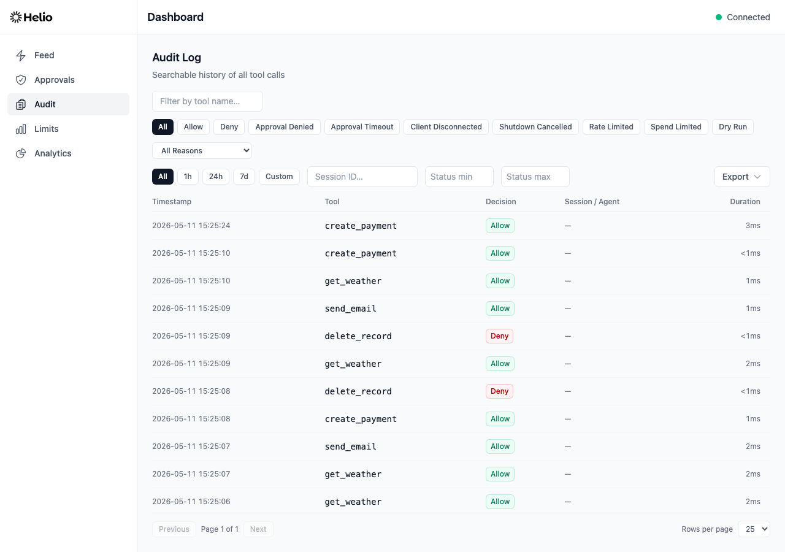

# Audit Trail

Every `tools/call` request that passes through Helio is recorded in an audit trail — including the tool name, arguments, policy decision, approval outcome, upstream response, and timing. Audit records are written asynchronously so they never slow down the request path.

## What's Recorded

Each audit record contains the following fields:

| Field                  | Type           | Description                                                                                                                                                                                          |
| ---------------------- | -------------- | ---------------------------------------------------------------------------------------------------------------------------------------------------------------------------------------------------- |
| `id`                   | string         | Unique record identifier (UUID v4).                                                                                                                                                                  |
| `timestamp`            | string         | ISO 8601 timestamp of when the proxy received the tool call.                                                                                                                                         |
| `session_id`           | string \| null | MCP session ID from the `Mcp-Session-Id` header.                                                                                                                                                     |
| `agent_id`             | string \| null | Agent identifier, if available.                                                                                                                                                                      |
| `environment`          | string \| null | Runtime environment label configured at proxy startup.                                                                                                                                               |
| `tool_name`            | string         | The name of the tool that was called.                                                                                                                                                                |
| `tool_input`           | object         | The full arguments passed to the tool call.                                                                                                                                                          |
| `policy_decision`      | string         | The policy engine's decision: `allow`, `deny`, `require_approval`, `rate_limit`, `spend_limit`, or `dry_run`.                                                                                        |
| `block_reason`         | string \| null | Structured deny/block reason (`evidence_missing`, `approval_timeout`, `client_disconnected`, `shutdown_cancelled`, `install_denied` for a `deny_install` install scan, etc.). Null when not blocked. |
| `matched_rule`         | string \| null | Name of the policy rule that matched, or null if the default action applied.                                                                                                                         |
| `matched_rule_index`   | number \| null | Rule index in config order that matched, or null when no rule matched.                                                                                                                               |
| `evidence_chain`       | object \| null | Evidence and dependency state from the evidence grounding system.                                                                                                                                    |
| `approval_status`      | string \| null | Approval outcome: `approved`, `denied`, `timeout`, `break_glass`, `client_disconnected`, or `shutdown_cancelled`. Null if no approval was required.                                                  |
| `approved_by`          | string \| null | Identity of the human who resolved approval (`approved`, `denied`, or `break_glass`), when applicable.                                                                                               |
| `upstream_response`    | any \| null    | The upstream MCP server's response. Null for denied calls (no upstream request was made).                                                                                                            |
| `upstream_error`       | string \| null | Error message from the upstream server, if the call failed.                                                                                                                                          |
| `upstream_http_status` | number \| null | Upstream HTTP status code when an upstream response was received. Null on denied or connection-level forwarding failures.                                                                            |
| `upstream_latency_ms`  | number \| null | Time in milliseconds the upstream request took. Null for denied calls.                                                                                                                               |
| `total_duration_ms`    | number         | End-to-end duration from request receipt to final response.                                                                                                                                          |
| `approval_wait_ms`     | number         | Time spent waiting in the approval queue/timer. Zero when no approval hold occurred.                                                                                                                 |
| `proxy_compute_ms`     | number         | Proxy compute time excluding approval wait and upstream processing.                                                                                                                                  |
| `flagged_destructive`  | boolean        | Whether the tool was flagged as potentially destructive (`destructiveHint: true`).                                                                                                                   |
| `dry_run`              | boolean        | Whether this record was produced in dry-run mode.                                                                                                                                                    |
| `record_kind`          | string         | Record category: `tool_call` (default), `drift_event`, `install_scan`, or `evaluation_expired` (a sideband decision that was never audited).                                                         |
| `origin`               | string         | Enforcement origin: `mcp` for the proxy path, or an adapter origin string (e.g. `openclaw`) for [sideband-governed](./adapter-api.md) calls.                                                         |
| `metadata`             | object \| null | Adapter-supplied context (reserved keys `channel_id`, `sender_id`, `sender_name`, `conversation_id`). Null for MCP-origin records.                                                                   |
| `created_at`           | string         | ISO 8601 timestamp of when the record was persisted to the database.                                                                                                                                 |

## Tool Definition Drift Records

In addition to tool-call records, Helio writes immediate audit records when a tool's definition changes after its baseline was captured at startup. These records describe changes to the upstream definition, not tool calls.

**`policy_decision: tool_drift`** — A tool's definition changed after baseline. `evidence_chain.tool_drift.changes` is an array of per-aspect before/after diffs: each entry has `aspect` (e.g. `annotations`, `inputSchema`, `description`), `baseline`, and `current`. Because no tool call occurred, `tool_input` is empty and all upstream fields (`upstream_response`, `upstream_error`, `upstream_http_status`, `upstream_latency_ms`) are null.

**`policy_decision: tool_drift_reverted`** — A previously drifted tool's definition returned to its baseline. `evidence_chain` is null; `tool_input` is empty and upstream fields are null.

Both record types are written via `pushImmediate` so they appear in the audit trail before any subsequent tool call that may be gated on the drift state.

Drift events are excluded from the dashboard's allowed-call totals and top-tools rankings; they remain visible in the feed, overall totals, and the by-decision breakdown.

> **Note:** Baselines are per-process. Restarting Helio re-baselines all tool definitions. Review any outstanding `tool_drift` records before restarting to ensure you understand what changed.

## Storage Backend

Audit records are stored in a local SQLite database using WAL (Write-Ahead Logging) mode for optimal concurrent read/write performance.

**Database configuration:**

```yaml
audit:
  storage: sqlite
  path: ./helio-audit.db # Default path
  retention: 90d # Auto-delete after 90 days
  include_responses: true # Store full upstream responses
```

**Indexes** are created on `created_at`, `tool_name`, `policy_decision`, `block_reason`, and `session_id` for fast queries, plus a composite `(upstream_http_status, created_at)` index for upstream status rollups and status-over-time alert queries.

### Local Schema Resets (Pre-1.0)

Helio currently uses a clean-break local schema policy for the audit SQLite file. If startup reports an audit schema mismatch (for example after pulling a new build that introduces a required column), reset local audit files and restart:

```bash
rm helio-audit.db helio-audit.db-wal helio-audit.db-shm
```

If your `audit.path` points elsewhere, delete that path and its `-wal` / `-shm` sidecars instead.

## Response Recording

The `include_responses` setting controls how much of the upstream response is stored:

- **`true` (default)** — The full JSON-RPC response body is stored. This gives you complete visibility into what the upstream server returned.
- **`false`** — Only a summary is stored (success/error status and content types). Use this for privacy-sensitive deployments or to reduce database size.

Denied calls always have a null `upstream_response` since no upstream request was made.

## Dashboard

The dashboard provides two views for audit data:

- **Feed tab** — A real-time stream of tool calls as they happen, powered by Server-Sent Events. Each action card shows the tool name, policy decision, timing, and matched rule.
- **Audit tab** — A searchable, filterable, paginated log of all recorded actions. Click any record to see full details including tool arguments, upstream response, and evidence chain.



**Available filters in the Audit tab:**

- Tool name (substring match)
- Policy decision (allow, deny, require_approval, etc.)
- Block reason (`evidence_missing`, `evidence_expired`, etc.)
- Session ID
- Agent ID
- Time range (from/to)
- Upstream HTTP status range (`upstream_status_min` / `upstream_status_max`)
- Destructive flag
- Dry-run flag

## CLI Export

Export audit records from the command line using `helio export`:

```bash
helio export
```

**Options:**

| Flag                    | Type   | Default      | Description                                            |
| ----------------------- | ------ | ------------ | ------------------------------------------------------ |
| `-c, --config <path>`   | string | `helio.yaml` | Path to the config file (used to locate the database). |
| `-f, --format <format>` | string | `json`       | Output format: `json` or `csv`.                        |
| `--tool <name>`         | string | —            | Filter by tool name.                                   |
| `--decision <decision>` | string | —            | Filter by policy decision.                             |
| `--reason <reason>`     | string | —            | Filter by block reason.                                |
| `--session <id>`        | string | —            | Filter by session ID.                                  |
| `--from <iso>`          | string | —            | Start time (ISO 8601).                                 |
| `--to <iso>`            | string | —            | End time (ISO 8601).                                   |
| `--limit <n>`           | number | `1000`       | Maximum number of records to export.                   |

**Examples:**

```bash
# Export all records as JSON
helio export

# Export denied actions as CSV
helio export -f csv --decision deny

# Export the last hour for a specific tool
helio export --tool create_payment --from "2026-04-09T11:00:00Z" --to "2026-04-09T12:00:00Z"

# Export to a file
helio export -f csv > audit-report.csv
```

Audit data is written to stdout; status messages go to stderr. This means you can pipe or redirect the output without capturing log messages.

## Dashboard API Export

The dashboard API provides a bulk export endpoint:

```
GET /api/audit/export
```

**Query parameters:**

| Parameter             | Default | Description                                     |
| --------------------- | ------- | ----------------------------------------------- |
| `format`              | `json`  | Output format: `json` or `csv`.                 |
| `limit`               | `10000` | Maximum records (up to 10,000).                 |
| `tool`                | —       | Filter by tool name.                            |
| `decision`            | —       | Filter by policy decision.                      |
| `reason`              | —       | Filter by block reason.                         |
| `session`             | —       | Filter by session ID.                           |
| `agent`               | —       | Filter by agent ID.                             |
| `from`                | —       | Start time (ISO 8601).                          |
| `to`                  | —       | End time (ISO 8601).                            |
| `upstream_status_min` | —       | Minimum upstream HTTP status (inclusive).       |
| `upstream_status_max` | —       | Maximum upstream HTTP status (inclusive).       |
| `blocked`             | —       | Filter by blocked vs. allowed (`true`/`false`). |
| `dry_run`             | —       | Filter by dry-run mode (`true`/`false`).        |

**Examples:**

```bash
# Export as JSON via the dashboard API
curl -s -H "Authorization: Bearer $HELIO_DASHBOARD_SECRET" \
  http://localhost:3100/api/audit/export > audit.json

# Export as CSV with filters
curl -s -H "Authorization: Bearer $HELIO_DASHBOARD_SECRET" \
  "http://localhost:3100/api/audit/export?format=csv&decision=deny&limit=500" > denied.csv
```

With `dashboard.api_secret` enabled, browser dashboard sessions authenticate via
`POST /api/auth/session` + HttpOnly cookie. Non-browser clients may continue to
use `Authorization: Bearer <api_secret>` for protected `/api/*` calls (everything
except `/api/health`, `/api/auth/session`, and `/api/auth/logout`).
The export response includes a `Content-Disposition` header for browser downloads.

## CSV Format

CSV exports include all 24 audit record fields:

`id`, `timestamp`, `session_id`, `agent_id`, `tool_name`, `tool_input`, `policy_decision`, `block_reason`, `matched_rule`, `evidence_chain`, `approval_status`, `approved_by`, `upstream_response`, `upstream_error`, `upstream_http_status`, `upstream_latency_ms`, `total_duration_ms`, `approval_wait_ms`, `proxy_compute_ms`, `flagged_destructive`, `dry_run`, `created_at`, `environment`, `matched_rule_index`

Dashboard API CSV exports (`GET /api/audit/export?format=csv`) serialize object fields (`tool_input`, `evidence_chain`, `upstream_response`) as JSON strings. Fields containing commas, newlines, or quotes are properly escaped per RFC 4180. Boolean values are exported as `true` or `false`. Null values are exported as empty strings.

`helio export -f csv` currently uses a lightweight serializer: it prints the same CSV headers and scalar fields, but leaves object-valued fields empty.

**Formula injection defense.** Any cell that would otherwise begin with `=`, `+`, `-`, `@`, a tab, or a carriage return is prefixed with a single quote (`'`) before being quoted. This prevents CSV-opened spreadsheet applications from interpreting audit data as a formula (CWE-1236).

## Retention

Audit records are automatically cleaned up based on the `audit.retention` setting:

```yaml
audit:
  retention: 90d # Default: 90 days
```

- Records older than the retention period are permanently deleted.
- Cleanup runs automatically every 24 hours and at proxy startup.
- Set a larger value (e.g. `365d`) if you need longer retention.

> **Note:** Retention cleanup is irreversible. If you need permanent audit records, export them before they expire or set retention to a very large value.

## Performance

The audit system is designed to add zero latency to the request path:

- **Async buffered writes** — Records are pushed to an in-memory buffer immediately (non-blocking). The buffer is flushed to SQLite in batches. Enforcement records (deny/approval/rate/spend blocks) are scheduled for a prioritized next-tick flush, while process crash handlers still synchronously drain buffered records before exit. Dashboard `action` SSE events are emitted on successful persistence, so live views do not race ahead of durable storage.
- **Batch size** — 50 records per flush, or every 100ms, whichever comes first.
- **Single-transaction batches** — Each flush uses a single SQLite transaction, so WAL mode syncs once per batch rather than once per record.
- **Throughput and overhead** — Validate on your hardware with the benchmark script: `pnpm --filter @gethelio/proxy benchmark`. The script generates a local report at `docs/benchmark-results.md` with environment-specific numbers.
- **Read-after-write window** — Because writes are batched, a query against `/api/audit?limit=1` fired immediately after a request can briefly see the previous "latest" row instead of the just-completed one. Allow records take up to 100ms to materialize; enforcement records (denies, approvals, rate/spend blocks) take roughly one event-loop tick. Live debugging tools should pause ~200ms between a request and an audit query that expects to see it, or use the SSE `action` feed (which is emitted on persistence, not on push).

For detailed numbers, run the benchmark script and inspect the generated local report at `docs/benchmark-results.md`.

## See Also

- [Sideband API Reference](./sideband-api.md) — Complete reference for every `/api/*` endpoint, including `/api/feed`, `/api/audit`, `/api/audit/:id`, and `/api/audit/export`
- [Configuration Reference](./configuration.md#audit) — Audit config fields and defaults
- [Policy Guide](./policies.md) — What generates audit records
- [Approval Workflows](./approvals.md) — How approval decisions appear in the audit trail
- `pnpm --filter @gethelio/proxy benchmark` — Generates local performance report at `docs/benchmark-results.md`
