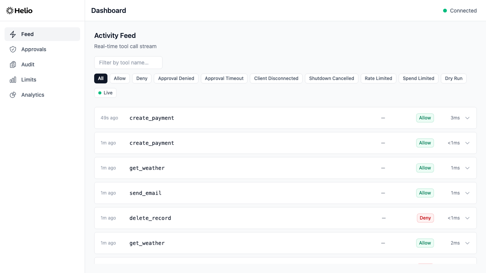
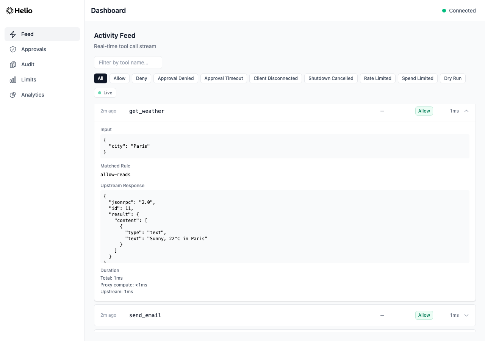

# Getting Started

Get Helio running in under 5 minutes. By the end, you'll have an MCP governance proxy intercepting tool calls, enforcing policy rules, and recording an audit trail — with a live dashboard showing everything.

## Prerequisites

- **Node.js 22+** — check with `node --version`
- **`jq` (optional)** — used in examples below for pretty-printing JSON. If unavailable, remove `| jq` and read raw JSON output.
- **An MCP server to govern** — any server that speaks Streamable HTTP, SSE, or stdio. Helio works with any spec-compliant MCP server (e.g. FastMCP, the official MCP SDKs) with zero changes to the server. **No server to test against?** Use the zero-dependency echo server below — no clone or install needed. (If you've cloned the repo as a contributor, you can instead run the bundled examples with `pnpm start`; see [`examples/basic/`](../examples/basic/).)

### No MCP server to test with?

Helio ships a tiny echo server that speaks MCP over plain `node:http` — no dependencies, no install. Save it and run it on the default upstream port:

```bash
curl -O https://raw.githubusercontent.com/gethelio/helio/main/examples/_shared/mcp-echo-server.mjs
node mcp-echo-server.mjs
```

It prints `MCP echo server listening on http://127.0.0.1:8080/mcp` and exposes a handful of demo tools (`get_weather`, `send_email`, `delete_record`, `create_payment`, `create_refund`) with realistic annotations, so the policy examples below have something meaningful to match. Leave it running in its own terminal — the default `upstream.url` (`http://localhost:8080/mcp`) already points at it.

## Step 1: Install

Scaffold a new configuration file:

```bash
npx @gethelio/proxy init
```

This creates a `helio.yaml` in your current directory with commented defaults. Alternatively, install globally:

```bash
npm install -g @gethelio/proxy
helio init
```

`@gethelio/proxy` includes the dashboard assets in the same package. There is no separate dashboard npm install step.

## Step 2: Configure

Open `helio.yaml` and set `upstream.url` to point at your MCP server.

> **Helio starts in audit-only mode.** `helio init` scaffolds the `policies` section **commented out**, so out of the box Helio runs with `default: allow` and **zero rules** — it records every tool call but **blocks nothing** until you add rules. The example below is an **illustrative target** (not the file `init` writes); uncomment and adapt `policies` to start enforcing. See the [Policy Guide](./policies.md) for rule syntax.

```yaml
version: '1'

upstream:
  url: 'http://localhost:8080/mcp'
  transport: streamable-http

listen:
  port: 3000
  host: '127.0.0.1'

dashboard:
  enabled: true
  port: 3100
  api_secret: '${HELIO_DASHBOARD_SECRET}'

policies:
  default: allow
  rules:
    - name: block-destructive
      match:
        annotations:
          destructiveHint: true
      action: deny
      feedback:
        message: 'Destructive operations are blocked by policy.'
        suggestion: 'Use a non-destructive alternative.'

    - name: allow-reads
      match:
        annotations:
          readOnlyHint: true
      action: allow

audit:
  storage: sqlite
  path: ./helio-audit.db
  retention: 90d
  include_responses: true
```

This example configuration blocks any tool marked as destructive, explicitly allows read-only tools, and falls through to `default: allow` for everything else. Every tool call is recorded to a local SQLite database. (Until you uncomment a `policies` block like this one, the scaffolded config blocks nothing.)

If you use the `${HELIO_DASHBOARD_SECRET}` placeholder above, export it before starting:

```bash
export HELIO_DASHBOARD_SECRET="$(openssl rand -hex 32)"
```

If you started from `helio init`, the generated `helio.yaml` already includes a secret, so you can keep that value instead.

See the [Configuration Reference](./configuration.md) for all available fields and defaults.

## Step 3: Start the Proxy

```bash
npx @gethelio/proxy start
# or: helio start   (if installed globally)
```

You should see output like:

```
Helio proxy listening on http://127.0.0.1:3000
Policies: 2 rules loaded (default: allow)
Upstream: http://localhost:8080/mcp (streamable-http)
Audit: ./helio-audit.db (retention: 90d)
Dashboard API listening on http://127.0.0.1:3100
Approvals: timeout 300s, default on timeout: deny, 0 channels configured
Rate limits: enabled
Spend limits: enabled
Config: helio.yaml
Watching helio.yaml for policy changes
```

> **Note:** Use `-c` to specify a different config file: `npx @gethelio/proxy start -c production.yaml`
>
> On startup, Helio also sends a synthetic upstream `tools/list` to warm the tool-annotation cache before first traffic. If the prime attempt cannot complete quickly, Helio continues startup and retries in the background. During that window, annotation matching remains fail-closed using MCP defaults.
>
> If `dashboard.enabled: true`, startup requires bundled dashboard assets to be present. If assets are missing, Helio exits with an actionable error instead of silently serving API-only mode.

## Step 4: Point Your MCP Client at Helio

Instead of connecting your MCP client directly to the upstream server, point it at the proxy on `http://localhost:3000/mcp`.

**Claude Desktop** (`claude_desktop_config.json`):

```json
{
  "mcpServers": {
    "my-server": {
      "url": "http://localhost:3000/mcp"
    }
  }
}
```

**Any HTTP MCP client** — change the server URL from `http://localhost:8080/mcp` to `http://localhost:3000/mcp`. The proxy is fully transparent: it forwards all MCP methods unchanged and only intercepts `tools/call` for policy evaluation.

**No client or agent handy?** You don't need one to try Helio:

- **MCP Inspector** — run `npx @modelcontextprotocol/inspector`, choose the Streamable HTTP transport, and point it at `http://localhost:3000/mcp`. Every tool call you make appears in the dashboard with its policy decision.
- **curl** — send a request straight through the proxy (see [Step 6](#step-6-send-a-test-tool-call) below). This works against any upstream, including the echo server.

### Error normalization behavior

For requests that pass JSON-RPC ingress validation at `/mcp`, Helio always returns a JSON-RPC response envelope.

- Valid upstream JSON-RPC responses pass through unchanged at the body layer.
- Upstream forwarding failures and non-JSON-RPC upstream payloads are normalized to:
  `{"jsonrpc":"2.0","id":<request-id>,"error":{"code":-32603,"message":"...","data":{"failure_class":"..."}}}`
- HTTP ingress validation errors (for example malformed JSON or wrong `Content-Type`) still return transport HTTP errors such as `400` or `415`.

## Step 5: Open the Dashboard

Navigate to [http://localhost:3100](http://localhost:3100) to open the governance dashboard. If `dashboard.api_secret` is set (recommended/default), enter that secret on the login screen first.



The dashboard has five tabs:

- **Feed** — Real-time stream of tool calls and policy decisions
- **Approvals** — Pending approval queue (for `require_approval` rules)
- **Audit** — Searchable log of every recorded action with filters
- **Limits** — Current rate and spend limit status per tool
- **Analytics** — Charts showing action volume, decision breakdown, and top tools

## Step 6: Send a Test Tool Call

With the proxy running, send a request through it:

> If `jq` is not installed, remove the trailing `| jq` from the commands below.

```bash
# List available tools
curl -s -X POST http://localhost:3000/mcp \
  -H 'Content-Type: application/json' \
  -d '{"jsonrpc":"2.0","id":1,"method":"tools/list"}' | jq
```

```bash
# Call a tool
curl -s -X POST http://localhost:3000/mcp \
  -H 'Content-Type: application/json' \
  -d '{"jsonrpc":"2.0","id":2,"method":"tools/call","params":{"name":"get_weather","arguments":{"city":"London"}}}' | jq
```

The tool call passes through the policy engine, gets forwarded to the upstream server, and the response is returned — with an audit record created in the background.



## Step 7: Try a Policy Rule

Add a rule to your config and watch hot-reload pick it up. With the proxy still running, edit `helio.yaml` and add a deny rule before the existing rules:

```yaml
rules:
  - name: block-email
    match:
      tool: 'send_email'
    action: deny
    feedback:
      message: 'Email sending is disabled.'
      suggestion: 'Contact your admin to enable email.'

  - name: block-destructive
    # ... existing rules
```

Save the file. The proxy detects the change and reloads:

```
[helio] Policy reloaded: 3 rules (default: allow)
```

Now try calling the blocked tool:

```bash
curl -s -X POST http://localhost:3000/mcp \
  -H 'Content-Type: application/json' \
  -d '{"jsonrpc":"2.0","id":3,"method":"tools/call","params":{"name":"send_email","arguments":{"to":"alice@example.com","body":"Hello"}}}' | jq
```

The response includes a structured error with the feedback message and suggestion — information an AI agent can use to self-correct.

## Docker

You can also run Helio with Docker Compose. One-time setup:

```bash
cd docker
cp .env.example .env
openssl rand -hex 32   # paste this into .env as HELIO_DASHBOARD_SECRET
docker compose up
```

This starts the proxy, a demo MCP echo server, and the dashboard. By default both published ports are bound to `127.0.0.1` on the host (not the LAN) so the quickstart is safe on untrusted networks. See [`docker/README.md`](../docker/README.md) for the security model and how to opt in to LAN or remote access.

To run Helio in its own container **next to a coding agent or dev container** — so the agent is forced through governance and can't reach the MCP server directly — see [Running Helio as a Sidecar](./deployment-sidecar.md).

## Production Checklist

The quickstart above is safe by default on a single-operator workstation. Before running Helio anywhere reachable from other people or machines, work through this checklist:

- **Generate and store a strong `dashboard.api_secret`.** `helio init` writes a fresh 256-bit hex value into `helio.yaml`; if you authored the file by hand, run `openssl rand -hex 32` and paste it into `dashboard.api_secret`. This value is stable until you rotate it. Treat it like a password-manager secret: if you lose it, you must generate a new one, update `helio.yaml`, and restart/reload the proxy.
- **Understand browser login behavior.** The dashboard UI now uses a manual secret login screen: enter `dashboard.api_secret` once, then the browser uses a short-lived HttpOnly session cookie. The raw secret is not injected into frontend JS anymore.
- **Keep `dashboard.host` on `127.0.0.1`.** The dashboard sideband assumes a single trust boundary and has no identity layer of its own. If you need to reach it remotely, put it behind a reverse proxy (nginx, Caddy, Cloudflare Access, Tailscale Serve) that terminates TLS and adds per-user authentication before forwarding to `127.0.0.1:3100`. Do not bind `dashboard.host` to `0.0.0.0` directly.
- **Keep the audit database on local disk.** Helio's audit sqlite file is created with mode `0600` (owner read/write only) — if you move it to a shared filesystem or back it up into an unencrypted bucket, you lose that isolation. Audit records contain tool inputs and upstream responses, often including PII and credentials.
- **Rotate secrets deliberately and expect session invalidation.** The proxy reads `dashboard.api_secret` from disk on startup and on config hot-reload. Change the value in `helio.yaml`, then restart/reload to rotate. Existing dashboard sessions are revoked and users must log in again with the new secret.
- **Keep the main MCP port behind the same trust boundary as the dashboard.** `listen.host` defaults to `127.0.0.1`; if you need remote agents, use a reverse proxy or SSH tunnel rather than binding to `0.0.0.0`. The main port does not carry the dashboard secret — it accepts MCP traffic based on network reachability alone.

## Next Steps

- [Configuration Reference](./configuration.md) — Every `helio.yaml` field with defaults and types
- [Running Helio as a Sidecar](./deployment-sidecar.md) — Deploy next to a coding agent / dev container so it can't bypass governance
- [Policy Guide](./policies.md) — Rule syntax, matchers, actions, rate limits, spend limits, and common patterns
- [Approval Workflows](./approvals.md) — Route sensitive actions to humans via Slack, webhook, or dashboard
- [Audit Trail](./audit.md) — What's recorded, how to search, and how to export
- [Examples](../examples/) — Three runnable configurations: basic, slack-approvals, spend-limits
